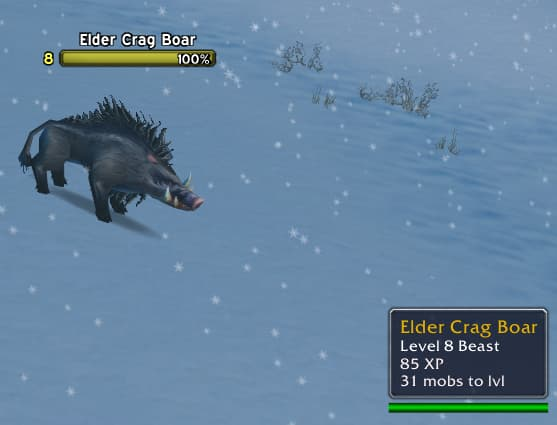

# ExpCalc
Vanilla 1.12.1 addon for World of Warcraft that shows exp gain from mobs and calculates how many kills to do before lvlup.

## Installation
1. Download **[Latest Version](https://github.com/MikeBeloborodov/ExpCalc/archive/refs/heads/main.zip)**
2. Unpack the Zip file
3. Rename the folder "ExpCalc-main" to "ExpCalc"
4. Copy "WowDevTools" into Wow-Directory\Interface\AddOns
5. Restart Wow